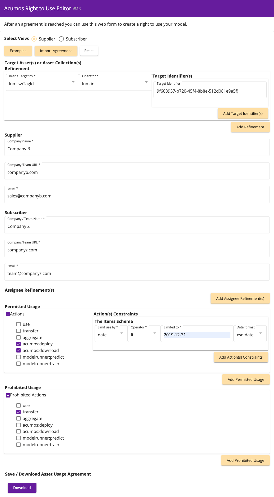

.. ===============LICENSE_START================================================
.. Acumos CC-BY-4.0
.. ============================================================================
.. Copyright (C) 2019 Nordix Foundation
.. ============================================================================
.. This Acumos documentation file is distributed by Nordix Foundation.
.. under the Creative Commons Attribution 4.0 International License
.. (the "License");
.. you may not use this file except in compliance with the License.
.. You may obtain a copy of the License at
..
..      http://creativecommons.org/licenses/by/4.0
..
.. This file is distributed on an "AS IS" BASIS,
.. WITHOUT WARRANTIES OR CONDITIONS OF ANY KIND, either express or implied.
.. See the License for the specific language governing permissions and
.. limitations under the License.
.. ===============LICENSE_END==================================================
..

======================================
License Right to Use Editor User Guide
======================================

The Right To Use (RTU) editor allows supplier and subscriber
to create, review and restrict asset usage agreements for using
the models.

Steps:

1.
The right to use flag in the license profile indicates
that a right to use agreement must be setup in license
usage manager. The creator of the software will always
be able to use the software. No agreement is required for
the creator.

2.
A Supplier

  - Defines an agreement

    - for a target asset or asset collection (one ML model at
      a specific version to a larger collection of models)
    - with specific permitted actions
    - with specific prohibited actions (optional)

  - Downloads the agreement.
  - Sends the agreement to subscriber.

3.
Subscriber reviews and saves the agreement into License Usage manager (LUM)

4. Subscriber can optionally add restrictions on top of
the agreement (such which user names are allowed to use the software)

The most basic Open Digital Rights Language (ODRL) agreement looks like this:

- Company A allows Company B to use "face-detect-model" at
  revision id "edc76757-cd54-4256-9c3d-f865d88db1ff"
  (no constraints)

  .. literalinclude:: ../license-rtu-editor/src/assets/exampledata/example006.json
  :language: json

- Agreement ready to be submitted to License Usage Manager
  PUT /api​/v1​/asset-usage-agreement

  .. literalinclude:: simple-agreement.json
  :language: json

Acumos Right to Use Actions
---------------------------

The Acumos platform is integrated with the license usage manager
to deny usage if agreed usage is out of bounds.

In the Clio release, the following actions can provide a denial:

  - acumos:download
  - acumos:deploy

Other actions that can be described in right to use but are not
being denied are:

  - transfer (such as allowing solution to be federated again)
  - aggregate (allowing model to be added to a composition model)
  - modelrunner:predict (calling the machine learning model methods api)
  - modelrunner:train (allowing retraining the machine learning models
    in a subscription)

Enabling License Right to Use (RTU) in license profile
--------------------------------------------------------

When you publish a model with a license profile that indicates
right to use required. An agreement / right to use agreement
for the software must be setup using the right to use editor
and license usage manager (LUM) service.

License Profile indicating right to use required:

  .. image:: images/license-profile-rtu-required.png

Sample field in license.json:

  .. code-block:: javascript

    "rtuRequired": true

Here is a License Profile for fictitious Company B for square model:

  .. image:: images/license-profile-rtu-required-full.png

Step 1: Supplier Defines an agreement
-------------------------------------

Target software:

- To target all versions of a model, use Acumos solution ID as
  the software persistent ID (lum:swPersistentId)
- To target specific version of a model, use Acumos revision ID as
  the software tag ID (lum:swTagId)
- To target specific version of a Catalog, use Acumos catalog ID as
  the catalog ID (lum:swCatalogId) - you can the ID find in the url
  when filtering on catalog in portal
- To target set of model solutions by name, use the lum:swProductName
  (this will match any solution by name)
- The lum:swCatalogType currently is for the public (PB)
  or restricted catalog (RS) - you just need to enter RS or PB.

Supplier:

- The Supplier Company name must match what is in the license profile
  company name.
- Please also enter the url of the company and email address.

Subscriber:

- The Subscriber name, url and email are required but are informational.

Permitted Actions:

- Please select actions that are allowed.

  - If you choose the "use" option then all sub actions will be allowed.

- Each action can have constraints by count or by date.
- If using date, the format is YYYY-MM-DD or 2019-10-31 for October 31, 2019
- When using download action it will count any artifact download
  for a solution as a download action.

Prohibited Actions:

- Any actions you do not allow, for example, "transfer" the software to
  another party.

Download the file and send to the subscriber.

In our example, we can create an agreement for square model
(solution id: b11dadf9-db03-43a8-94f4-e9f8155b8f42,
revision id: 9f603957-b720-45f4-8b8e-512d081e9a5f) which we received
from the URL parameters:
https://<ACUMOS_PORTAL_URL>#/marketSolutions?solutionId=b11dadf9-db03-43a8-94f4-e9f8155b8f42&revisionId=9f603957-b720-45f4-8b8e-512d081e9a5f&parentUrl=marketplace
using the RTU editor:

  .. image:: images/rtu-editor-agreement-companyb-companyz.png

Step 2: Supplier shares an agreement with Subscriber
----------------------------------------------------

- Once the Open Digital Rights Language (ODRL) agreement is defined
  using the RTU Editor, Supplier can click the download button to save
  the ODRL RTU agreement.
- Supplier shall share the ODRL RTU agreement with Subscriber.

Step 3:  A subscriber reviews and saves agreement
-------------------------------------------------

Once Subscriber receives the ODRL RTU agreement from Supplier,
The Subscriber can review the agreement by looking at the JSON or
by use the RTU editor to import the ODRL RTU agreement and review.

If you have LUM service available under the same domain as the
RTU editor then you can submit the agreement directly from
the RTU editor.

  .. image:: images/rtu-editor-review.png

Add the user name in the last field and if RTU editor
has been configured to work with LUM you can directly save to LUM.

Step 4:  A subscriber add restrictions to an existing agreement
---------------------------------------------------------------

This step is optional. A subscriber can use this step if they want to
assign team member's user names to the agreement or further narrow the
agreement's permissions and prohibitions.

You must know the Supplier's company name and the agreement Unique ID (or UID).

  .. image:: images/rtu-editor-restrictions.png

In above example, we are adding 2 users "consumer1" and "consumer2" and
adding prohibitions of "transfer" and "aggregation".

Troubleshooting Denial Messages
-------------------------------

Did the software get registered with LUM during publishing?

you may see this denial if software was published before license usage manager
was installed.

  .. image:: images/denial-message-no-swid-tag.png

– ie is there a SwidTag? yes or no?

If no republish the software or resubscribe to catalog.
If yes you may need an agreement.

If you don't have an agreement for the software you must get
one from the supplier.

This is the denial message you will see if there is no agreement
for the software:

  .. image:: images/denial-message-no-agreement.png

Do I need to create a new agreement with a software licensor?

There is no agreement in the agreement inventory that matches
this SwTagId or asset collections (SwPersistentId/SolutionId,
SwCatalogId, SwCatalogType, SwProductName, SwCategory).

Example agreement to resolve error:

.. literalinclude:: rtu-asset-usage-agreement-square.json
   :language: json

Do I need to have an amended agreement to include additional rights?

– Is there a close match such as there was an agreement
  for a revision id but now I need a new agreement for new revision.

Are there restricted rights that need to be amended?

Was the target restricted by the restrictions vs supplier agreement?

Right to Use Open Digital Rights Language (ODRL) agreement examples
-------------------------------------------------------------------

We have 7 different examples of license agreements:

- Use solution all versions no transfer, aggregate

.. literalinclude:: ../license-rtu-editor/src/assets/exampledata/example001.json
   :language: json

- Allow all software from a company

.. literalinclude:: ../license-rtu-editor/src/assets/exampledata/example002.json
   :language: json

- Allow all software from a catalog

.. literalinclude:: ../license-rtu-editor/src/assets/exampledata/example003.json
   :language: json

-  Allow all software from public catalogs

.. literalinclude:: ../license-rtu-editor/src/assets/exampledata/example004.json
   :language: json

- Face Detect Model - any usage

.. literalinclude:: ../license-rtu-editor/src/assets/exampledata/example005.json
   :language: json

- Face Detect Model - specific version can be used

.. literalinclude:: ../license-rtu-editor/src/assets/exampledata/example006.json
   :language: json

- Face Detect Model -  specific version, 10 users, expires,
  constrained actions, some prohibited actions.

.. literalinclude:: ../license-rtu-editor/src/assets/exampledata/example007.json
   :language: json

These should be customized for your licensing agreements.
The license rtu editor has a shortcut where
you can click on the example button to auto fill with these examples.

License RTU agreement Json Schema 1.0.1
---------------------------------------

The schema for the license rtu agreement - the supplier creates:

.. literalinclude:: ../license-rtu-editor/src/assets/schema/1.0.1/rtu-agreement.json
   :language: json

License RTU agreement restrictions Json Schema 1.0.1
----------------------------------------------------

The schema for the license rtu agreement restrictions
- the subscriber creates:

.. literalinclude:: ../license-rtu-editor/src/assets/schema/1.0.1/rtu-restrictions.json
   :language: json
